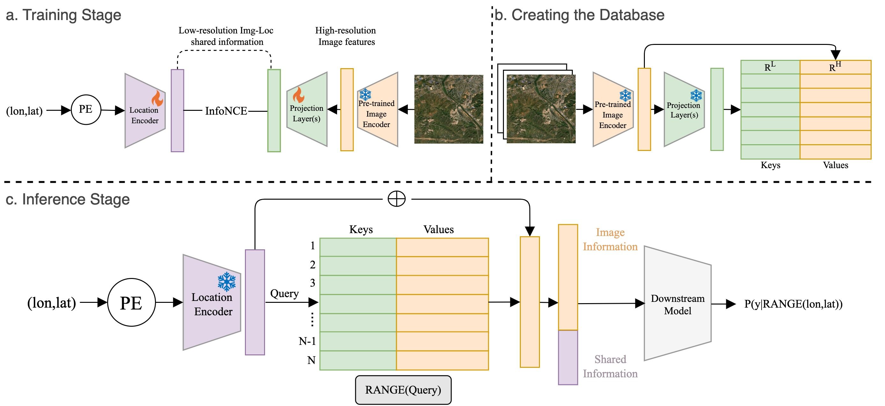
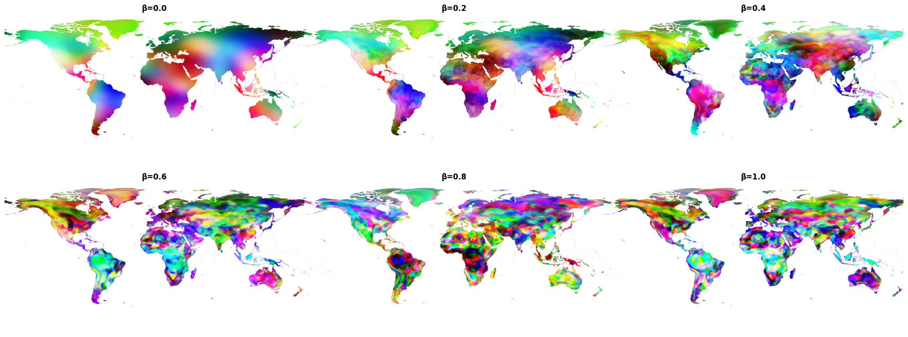
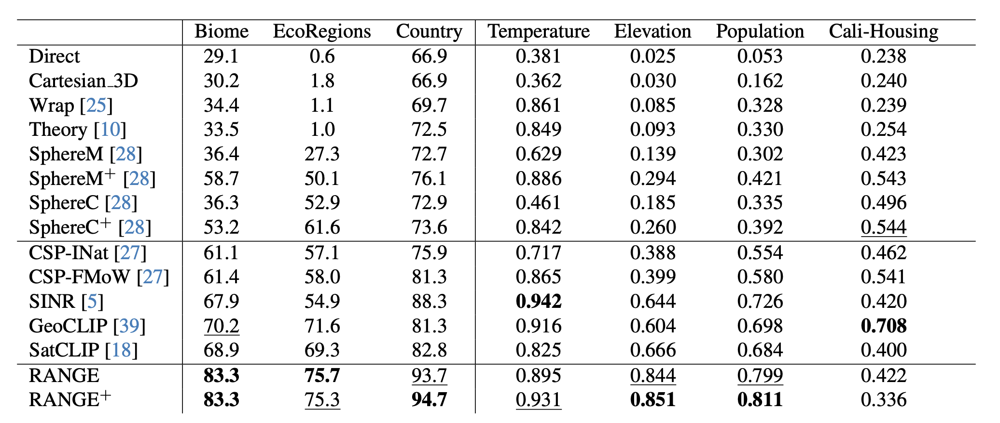

# RANGE: Retrieval Augmented Neural Fields for Multi-Resolution Geo-Embeddings (CVPR 2025) 🌎🌏🌍
<div align="center">

[](https://arxiv.org/abs/2502.19781)
[](https://huggingface.co/collections/MVRL/range-67e99fa1dfc6c86a3b872c09)

</center>

[Aayush Dhakal*](https://sites.wustl.edu/aayush/)&nbsp;&nbsp;&nbsp;
[Srikumar Sastry](https://vishu26.github.io/)&nbsp;&nbsp;&nbsp;
[Subash Khanal](https://subash-khanal.github.io/)&nbsp;&nbsp;&nbsp;
[Eric Xing](https://ericx003.github.io/)&nbsp;&nbsp;&nbsp;
[Adeel Ahmad](https://adealgis.wixsite.com/adeel-ahmad-geog)&nbsp;&nbsp;&nbsp;
[Nathan Jacobs](https://jacobsn.github.io/)


</div>
<br>
<br>
This repository is the official implementation of [RANGE](https://arxiv.org/abs/2502.19781).
RANGE (Retrieval Augmented Neural Fields for Multi-Resolution Geo-Embeddings) is a retrieval-augmented framework for embedding geographic coordinates. RANGE directly estimates the visual features for a given location, allowing the representations to capture high-resolution information. 



## 🔥 Multi-scale Geoembeddings
Our method enforces a spatial smoothness constraint. Manipulating this constraint allows generating geo-embeddings at desired frequencies.


## 🏋️‍♂️ Performance on Downstream Tasks
We showed through a large number of downstream tasks that RANGE embeddings outperform several state-of-the-art location embedding methods such as SatCLIP, GeoCLIP, CSP, etc.



## ⚙️ Usage
The required model weights and embeddings are made available in huggingface. 


🗄️ Download the precomputed RANGE database. Currently, there are two possible choices: `range_db_large.npz` and `range_db_med.npz`:
```python
git clone git@github.com:mvrl/RANGE.git
cd RANGE
huggingface-cli download mvrl/RANGE-database range_db_large.npz \
  --repo-type dataset \
  --local-dir ./pretrained/range \
  --local-dir-use-symlinks False
```
📡 Download base SatCLIP model:
```python
huggingface-cli download microsoft/SatCLIP-ViT16-L40 satclip-vit16-l40.ckpt \
   --repo-type=model \
   --local-dir=./pretrained/range \
   --local-dir-use-symlinks=False 
```
💻 Compute RANGE embeddings using `load_model.py` 
```python
# Create a new python file: touch ./range/test.py
import os
import torch
#local import
from .load_model import load_model

#define the model
model_name = 'RANGE+'
pretrained_dir = './pretrained'
db_path = os.path.join(pretrained_dir, 'range/range_db_large.npz')
device = 'cuda' if torch.cuda.is_available() else 'cpu'
beta = 0.5
rangep_model = load_model(model_name='RANGE+', 
                          pretrained_dir=pretrained_dir, device='cuda', db_path=db_path, beta=0.5)
#generate embeddings
locs = torch.rand(10000, 2).double().to(device)
embeddings = rangep_model(locs)
print(embeddings.shape)
```
```python
python -m range.test
------------------------------
Output: (10000, 1280)
```
The `load_model` module can be used to load other soTA location encoders such as SatCLIP, GeoCLIP, CSP, SINR, etc. Look inside `./range/load_model.py` file for details on usage and which location encoders are currently supported.  

📑 Citation

```bibtex
@article{dhakal2025range,
  title={RANGE: Retrieval Augmented Neural Fields for Multi-Resolution Geo-Embeddings},
  author={Dhakal, Aayush and Sastry, Srikumar and Khanal, Subash and Ahmad, Adeel and Xing, Eric and Jacobs, Nathan},
  booktitle={Computer Vision and Pattern Recognition},
  year={2025},
  organization={IEEE/CVF}
}
```


## 🔍 Additional Links
Check out our lab website for other interesting works on geospatial understanding and mapping:
* [Multi-Modal Vision Research Lab (MVRL)](https://mvrl.cse.wustl.edu/)
* [Related Works from MVRL](https://mvrl.cse.wustl.edu/publications/)
