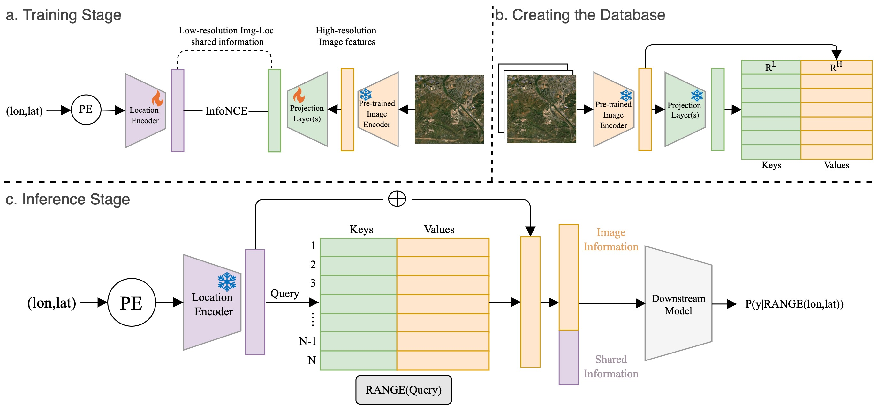
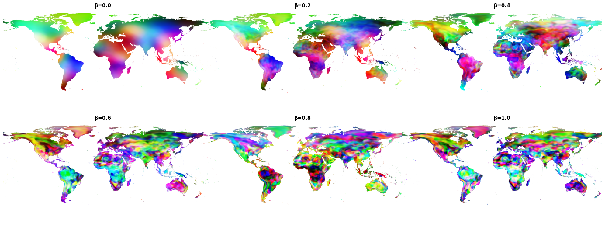
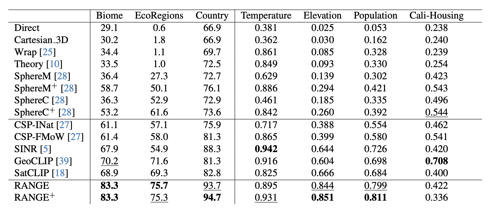

# RANGE: Retrieval Augmented Neural Fields for Multi-Resolution Geo-Embeddings (CVPR 2025) 🌎🌍🌏
<div align="center">

[](https://arxiv.org/abs/2502.19781)
[](https://huggingface.co/collections/MVRL/range-67e99fa1dfc6c86a3b872c09)
[](https://pypi.org/project/rangegeo/)

</center>

[Aayush Dhakal*](https://sites.wustl.edu/aayush/)&nbsp;&nbsp;&nbsp;
[Srikumar Sastry](https://vishu26.github.io/)&nbsp;&nbsp;&nbsp;
[Subash Khanal](https://subash-khanal.github.io/)&nbsp;&nbsp;&nbsp;
[Eric Xing](https://ericx003.github.io/)&nbsp;&nbsp;&nbsp;
[Adeel Ahmad](https://adealgis.wixsite.com/adeel-ahmad-geog)&nbsp;&nbsp;&nbsp;
[Nathan Jacobs](https://jacobsn.github.io/)


</div>
<br>
<br>
This repository is the official implementation of RANGE. RANGE (Retrieval Augmented Neural Fields for Multi-Resolution Geo-Embeddings) is a retrieval-augmented framework for embedding geographic coordinates. RANGE directly estimates the visual features for a given location, allowing the representations to capture high-resolution information. 
<br>
<br>



## 🔥 Multi-scale Geoembeddings
Our method enforces a spatial smoothness constraint. Manipulating this constraint allows generating geo-embeddings at desired frequencies.
<br>



## 🏋️‍♂️ Performance on Downstream Tasks
We showed through a large number of downstream tasks that RANGE embeddings outperform several state-of-the-art location embedding methods such as SatCLIP, GeoCLIP, CSP, etc.
<br>




## 🚀 Quick Start (pip)
Install the inference-only package ([rangegeo on PyPI](https://pypi.org/project/rangegeo/)):
```bash
pip install rangegeo
```

Get embeddings for any location in three lines — the SatCLIP backbone and the RANGE retrieval database are downloaded automatically from HuggingFace on first use (cached afterwards):
```python
from rangegeo import RANGE

model = RANGE("RANGE+", db="large", beta=0.5)   # or "RANGE"; db: "large" | "med"
embeddings = model.encode([[-90.19, 38.63], [85.32, 27.72]])  # (lon, lat) in degrees
print(embeddings.shape)  # (2, 1280)
```
`model.encode` accepts any `(N, 2)` array-like of (longitude, latitude) degrees and returns a numpy array; for GPU it batches internally (default batch size 10000). To use a fine-tuned backbone or a regenerated database, pass `pretrained_path=` and/or `db_path=`. The model is a regular `torch.nn.Module`, so `model(coords_tensor)` also works inside a torch pipeline.

## ⚙️ Usage (research code)
The `rangegeo` package above only contains what is needed for inference. The full research code (training, evaluation, baselines such as SatCLIP/GeoCLIP/CSP/SINR) lives in the `range/` directory of this repo and is used by cloning the repo as described below.

The required model weights and embeddings are made available in huggingface. You can download the precomputed RANGE database using huggingface-cli. Currently, there are two possible choices: `range_db_large.npz` and `range_db_med.npz`.
```python
git clone git@github.com:mvrl/RANGE.git
cd RANGE
#this is optional as we can directly do this inside our python script
huggingface-cli download mvrl/RANGE-database range_db_large.npz \
  --repo-type dataset \
  --local-dir ./pretrained/range \
  --local-dir-use-symlinks False
```

💻 Compute RANGE embeddings using `load_model` 
```python
# Create a new python file: touch ./range/test.py
import os
import torch
from huggingface_hub import hf_hub_download
from sklearn.preprocessing import MinMaxScaler

#import load_model locally
from .load_model import load_model

device = 'cuda' if torch.cuda.is_available() else 'cpu'
#get path to the pretrained SatCLIP model
pretrained_path =  hf_hub_download('microsoft/SatCLIP-ViT16-L40', 'satclip-vit16-l40.ckpt',
                                        repo_type='model', local_dir='./pretrained/range', local_dir_use_symlinks=False)

#get path to the RANGE database
db_path = hf_hub_download('mvrl/RANGE-database', 'range_db_large.npz',
                             repo_type='dataset', local_dir='./pretrained/range', local_dir_use_symlinks=False)

#define the model you want to load
model_name = 'RANGE+'
#set the beta parameter
beta = 0.5

#initialize model using load_model
rangep_model = load_model(model_name=model_name, pretrained_path=pretrained_path,
                               device=device, db_path=db_path, beta=beta)

#create a random Nx2 tensor    
a = torch.rand(10000,2).double().to(device)

#generate embeddings
# For optimal performance, use a veryyy large batch size.
# We consistently used a batch size of 10000 or higher when computing embeddings.
locs = torch.rand(10000, 2).double().to(device)
embeddings = rangep_model(locs)
scaler = MinMaxScaler()
scaled_embeddings = scaler.fit_transform(embeddings)
print(scaled_embeddings.shape)
```
```python
python -m range.test
------------------------------
Output: (10000, 1280)
```
The `load_model` module can be used to load other soTA location encoders such as `SatCLIP, GeoCLIP, CSP, SINR`, etc. Look inside `./range/load_model.py` file for details on usage and which location encoders are currently supported.  

## 🧪 Fine-tuning Note
RANGE is a post-training optimization on top of a backbone encoder. To adapt RANGE to a region-specific fine-tuned setup, fine-tune the backbone first (e.g., SatCLIP image encoder), then regenerate the RANGE database keys using embeddings from that fine-tuned encoder (see `./range/generate_db.py`).

📑 Citation

```bibtex
@article{dhakal2025range,
  title={RANGE: Retrieval Augmented Neural Fields for Multi-Resolution Geo-Embeddings},
  author={Dhakal, Aayush and Sastry, Srikumar and Khanal, Subash and Ahmad, Adeel and Xing, Eric and Jacobs, Nathan},
  booktitle={Computer Vision and Pattern Recognition},
  year={2025},
  organization={IEEE/CVF}
}
```


## 🔍 Additional Links
Check out our lab website for other interesting works on geospatial understanding and mapping:
* [Multi-Modal Vision Research Lab (MVRL)](https://mvrl.cse.wustl.edu/)
* [Related Works from MVRL](https://mvrl.cse.wustl.edu/publications/)
